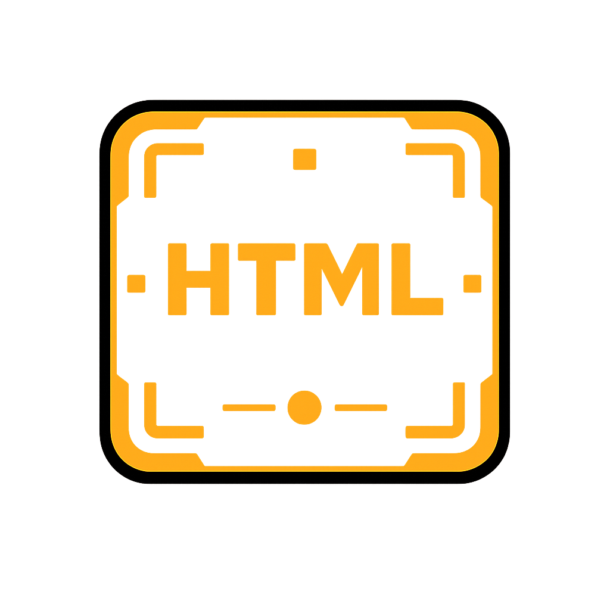

<div align="center">

# HTMLView

## A lightweight, cross-platform HTML viewer for Rust.



[](https://crates.io/crates/html_view)
[](https://docs.rs/html_view)
[](https://github.com/jmg049/HTMLView#license)
[](https://www.rust-lang.org)
</div>

---

A lightweight, cross-platform HTML viewer for Rust.

`html_view` provides a minimal, ergonomic API for rendering HTML content in a native window, similar in spirit to `matplotlib.pyplot.show()` for visualization rather than UI development.

It is intended for debugging, inspection, and lightweight display, not for building full desktop applications.

The need/want for a tool like this came from wanting to incorporate plotting functionality into my other crates which deal with audio:

- [audio_samples](https://github.com/jmg049/audio_samples)
- [audio_samples_io](https://github.com/jmg049/audio_samples)
- [audio_samples_python](https://github.com/jmg049/audio_samples)

## Quick Start

1. Install the viewer application (one-time setup):

```bash
cargo install html_view_app
```

2. Add the library to your project:

```bash
cargo add html_view
```

3. Display HTML with a single line:

```rust
html_view::show("<h1>Hello, World!</h1>")?;
```

That's it! See [Usage Patterns](#usage-patterns) for more examples.

## Table of Contents

- [What This Is (and Is Not)](#what-this-is-and-is-not)
- [How It Works](#how-it-works)
- [Installation](#installation)
- [Usage Patterns](#usage-patterns)
- [Core Features](#core-features)
- [Security](#security)
- [Command-Line Interface](#command-line-interface)
- [Platform Requirements](#platform-requirements)
- [Building from Source](#building-from-source)
- [Examples](#examples)
- [Contributing](#contributing)
- [License](#license)

## What This Is (and Is Not)

**html_view is:**

- A quick way to render HTML from Rust
- Useful for visualization, debugging, reports, and local tools
- Designed to require minimal setup and minimal code
- Perfect for one-off displays or temporary windows

**html_view is not:**

- A GUI framework
- A browser replacement
- A long-lived embedded webview inside your process
- A solution for complex application state or interaction

If you need a full application framework, use [Tauri](https://tauri.app), [egui](https://github.com/emilk/egui), [iced](https://github.com/iced-rs/iced), or a native GUI toolkit directly.

## How It Works

`html_view` works by launching a small, native Tauri application as a **separate process** and sending it instructions over a simple JSON-based protocol.

```text
┌─────────────────┐        JSON Files         ┌──────────────────┐
│                 │  ──────────────────────>  │                  │
│  Your Rust App  │                           │  html_view_app   │
│                 │  <────────────────────    │  (Tauri 2.0)     │
│                 │    Exit Status + UUID     │                  │
└─────────────────┘                           └──────────────────┘
     Process A                                     Process B
```

**This design:**

- Keeps your Rust process lightweight and isolated
- Avoids embedding webview state or event loops
- Allows blocking or non-blocking execution
- Makes failures and crashes contained and debuggable
- Enables version compatibility checking between library and viewer

You install the viewer once, then reuse it across projects.

## Installation

### Quick Start (Recommended for New Users)

The easiest way to get started with bundled binary auto-download:

```bash
cargo add html_view --features bundled
```

The pre-built viewer binary will be automatically downloaded during the first build.

### Manual Installation (Minimal Approach)

For minimal dependencies or when you prefer explicit control, install the library and viewer separately:

**1. Install the library:**

```bash
cargo add html_view
```

**2. Install the viewer binary:**

```bash
cargo install html_view_app
```

### Binary Location

The library will automatically find the binary in this order:

1. Bundled binary (if `bundled` feature was used)
2. `HTML_VIEW_APP_PATH` environment variable
3. `~/.cargo/bin/html_view_app` (from `cargo install`)
4. Same directory as your executable
5. `target/debug` or `target/release` (for development)

If the binary isn't found, you'll get an error message showing all paths checked.

### Optional: Command-Line Tool

For using the viewer without writing Rust code:

```bash
cargo install html_view_cli
```

See [Command-Line Interface](#command-line-interface) for usage.

## Usage Patterns

### Inline HTML

The simplest way to display HTML:

```rust
use html_view;

fn main() -> Result<(), html_view::ViewerError> {
    html_view::show("<h1>Hello!</h1><p>Simple HTML display</p>")?;
    Ok(())
}
```

### Configurable Window

Customize window size, title, and behavior:

```rust
use html_view::ViewerOptions;

let mut options = ViewerOptions::inline_html("<h1>Custom Window</h1>");
options.window.width = Some(800);
options.window.height = Some(600);
options.window.title = Some("My App".to_string());
options.behaviour.enable_devtools = true;

html_view::open(options)?;
```

Or use the fluent builder API:

```rust
use html_view::ViewerOptions;

ViewerOptions::new()
    .width(800)
    .height(600)
    .title("My App")
    .devtools()
    .show_html("<h1>Custom Window</h1>")?;
```

### Non-blocking Execution

Don't wait for the window to close:

```rust
use html_view::{ViewerOptions, ViewerWaitMode, ViewerResult};

let mut options = ViewerOptions::inline_html("<h1>Non-blocking</h1>");
options.wait = ViewerWaitMode::NonBlocking;

match html_view::open(options)? {
    ViewerResult::NonBlocking(mut handle) => {
        // Do other work here
        println!("Viewer is running with ID: {}", handle.id);

        // Check if it's still running
        while handle.try_wait()?.is_none() {
            std::thread::sleep(std::time::Duration::from_millis(100));
            // Do work...
        }

        // Or wait for it to close
        let status = handle.wait()?;
        println!("Viewer closed: {:?}", status.reason);
    }
    _ => unreachable!(),
}
```

### Loading Files and Directories

Load HTML from the filesystem:

```rust
use html_view::ViewerOptions;
use std::path::PathBuf;

// Single HTML file
let options = ViewerOptions::local_file(PathBuf::from("index.html"));
html_view::open(options)?;

// Application directory (with assets)
let mut options = ViewerOptions::app_dir(PathBuf::from("./dist"));
// Optional: specify entry file (defaults to index.html)
if let html_view_shared::ViewerContent::AppDir { entry, .. } = &mut options.content {
    *entry = Some("main.html".to_string());
}
html_view::open(options)?;
```

### Remote URLs

Display web content (requires explicit opt-in for security):

```rust
use html_view::ViewerOptions;
use url::Url;

let mut options = ViewerOptions::remote_url(
    Url::parse("https://example.com")?
);

// Must explicitly allow remote content
options.behaviour.allow_remote_content = true;
options.behaviour.allow_external_navigation = true;

// Optional: restrict to specific domains
options.behaviour.allowed_domains = Some(vec![
    "example.com".to_string(),
    "api.example.com".to_string(),
]);

html_view::open(options)?;
```

### Time-Limited Display

Auto-close the window after a timeout:

```rust
use html_view::ViewerOptions;

let mut options = ViewerOptions::inline_html("<h1>Auto-close in 5 seconds</h1>");
options.environment.timeout_seconds = Some(5);

html_view::open(options)?;
// Window automatically closes after 5 seconds
```

### Frameless Windows with Custom Toolbar

Create a frameless window with a custom title bar:

```rust
use html_view::ViewerOptions;

let mut options = ViewerOptions::inline_html("<h1>Frameless Window</h1>");
options.window.decorations = false;
options.window.toolbar.show = true;
options.window.toolbar.title_text = Some("My Custom App".to_string());
options.window.toolbar.background_color = Some("#2C3E50".to_string());
options.window.toolbar.text_color = Some("#ECF0F1".to_string());

html_view::open(options)?;
```

## Core Features

- **Minimal API**: Single-function `show()` for most cases, `open()` for advanced config
- **Multiple Content Types**: Inline HTML, local files, app directories, remote URLs
- **Execution Modes**: Blocking (wait for close) or non-blocking (get a handle)
- **Window Control**: Size, position, decorations, transparency, always-on-top
- **Cross-Platform**: Native rendering on Linux (WebKitGTK), macOS (WKWebView), Windows (WebView2)
- **Version Checking**: Automatic compatibility verification between library and viewer
- **Process Isolation**: Viewer runs separately, no state pollution in your app

## Security

By default, `html_view` is locked down to prevent accidental security issues:

- Remote content is disabled
- External navigation is blocked
- Developer tools are disabled
- File dialogs are disabled
- Only provided content is rendered

### Enabling Remote Access

To display remote URLs or allow navigation:

```rust
let mut options = ViewerOptions::inline_html("<h1>Hello</h1>");
options.behaviour.allow_remote_content = true;
options.behaviour.allow_external_navigation = true;

// Optional: restrict navigation to specific domains
options.behaviour.allowed_domains = Some(vec![
    "example.com".to_string(),
    "trusted-site.com".to_string(),
]);
```

### Security Best Practices

1. **Never trust user input** in HTML content - sanitize it first
2. **Use domain allowlists** when enabling external navigation
3. **Disable remote content** unless absolutely needed
4. **Enable devtools only during development**, not in production
5. **Use HTTPS** for all remote URLs

## Command-Line Interface

The CLI provides a quick way to view HTML without writing Rust code.

### Installation

```bash
cargo install html_view_cli
```

### Usage

```bash
# Inline HTML
html_view_cli html "<h1>Hello, World!</h1>"

# Local file
html_view_cli file index.html

# Application directory
html_view_cli dir ./dist --entry main.html

# Remote URL
html_view_cli url https://example.com
```

### Common Options

```bash
html_view_cli html "<h1>Custom</h1>" \
  --width 800 \
  --height 600 \
  --title "My App" \
  --devtools \
  --timeout 10
```

See the [html_view_cli README](html_view_cli/README.md) for complete documentation.

## Platform Requirements

### Linux

Requires WebKitGTK 4.1:

```bash
# Debian/Ubuntu
sudo apt install libwebkit2gtk-4.1-dev

# Arch Linux
sudo pacman -S webkit2gtk-4.1
```

**Note**: At runtime, only the library is needed, not the `-dev` package:

```bash
sudo apt install libwebkit2gtk-4.1-0
```

### macOS

Uses the system WKWebView framework. No additional dependencies required.

**Minimum version**: macOS 10.13 (High Sierra) or later

### Windows

Uses Microsoft Edge WebView2, which is:

- Included by default in Windows 11
- Available for Windows 10 via Windows Update
- Downloadable as the [WebView2 Runtime](https://developer.microsoft.com/en-us/microsoft-edge/webview2/)

## Building from Source

### Quick Build

```bash
git clone https://github.com/jmg049/HTMLView.git
cd HTMLView
cargo build --workspace --release
```

### Installing from Source

To install the viewer application:

```bash
cargo install --path html_view_app
```

**Important**: The Tauri app bundles frontend assets. If you encounter issues:

```bash
# Build the entire workspace first
cargo build --workspace --release

# Then install from the built binary
cargo install --path html_view_app --force
```

### Development Builds

For development, you can run directly from the workspace:

```bash
# Run the viewer directly
cargo run -p html_view_app -- --help

# Run tests
cargo test --workspace

# Run examples
cargo run --example simple
```

## Examples

The repository includes several examples demonstrating different features:

```bash
# Simple inline HTML
cargo run --example simple

# Advanced configuration
cargo run --example advanced

# Timeout and auto-close
cargo run --example timeout
```

For more examples, see the [examples/](examples/) directory.

## Contributing

Contributions are welcome! Please see [CONTRIBUTING.md](CONTRIBUTING.md) for guidelines.

## License

This project is dual-licensed under:

- MIT License ([LICENSE-MIT](LICENSE-MIT) or <http://opensource.org/licenses/MIT>)

## Acknowledgements

Built using [Tauri 2.0](https://tauri.app).
